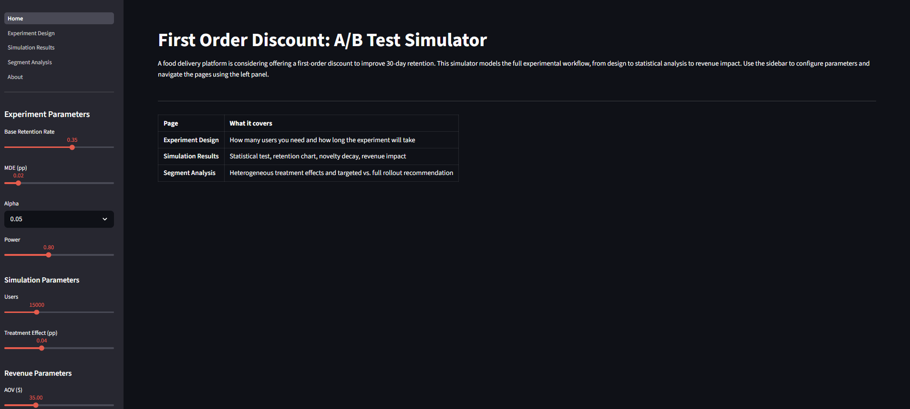
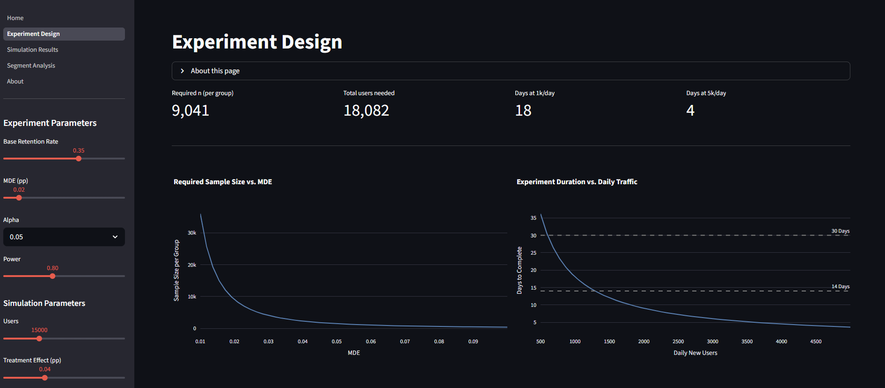
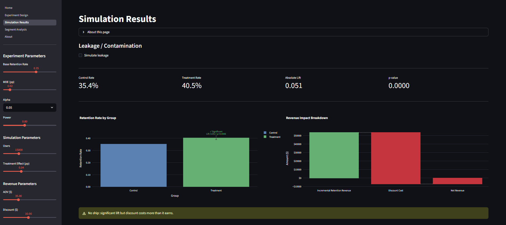
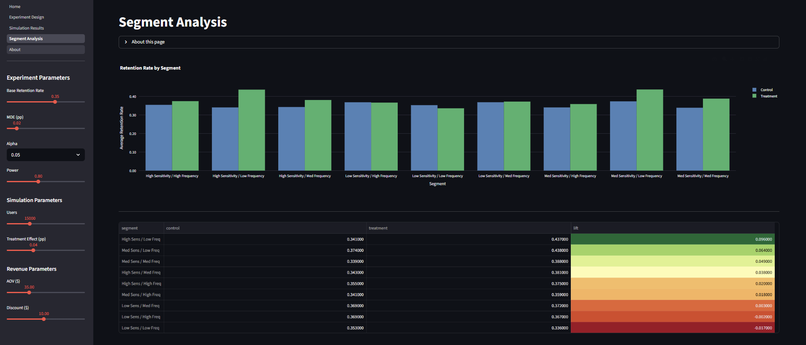

# A/B Test: First Order Discount and 30-Day Retention

## Overview

Simulated end-to-end A/B test evaluating whether a first-order discount increases 30-day retention on a food delivery platform. Built as an interactive Streamlit app covering experiment design, power analysis, statistical testing, novelty effect simulation, revenue impact, and segment analysis.

## Business Question

Does offering a $10 discount on a first order increase the likelihood of placing a second order within 30 days, and does the retention lift justify the cost of the discount?

## Experiment Design

| Parameter | Value |
|---|---|
| Randomization unit | User |
| Treatment | $10 discount on first order |
| Control | No discount |
| Primary metric | 30-day retention rate |
| Secondary metrics | Reorder rate, average order value |
| Significance level | 5% (configurable) |
| Statistical power | 80% (configurable) |
| Base retention rate | 27% |
| Minimum detectable effect | 4pp absolute |

## Methodology

**Experiment design**
- Two-proportion power analysis to determine required sample size
- Duration feasibility chart based on daily new user volume

**Statistical testing**
- Two-sample z-test of proportions with pooled SE for hypothesis test and unpooled SE for confidence interval
- Sample ratio mismatch detection via chi-squared goodness-of-fit test
- AA test simulation to verify false positive rate calibration
- Benjamini-Hochberg FDR correction across multiple metrics

**Simulation**
- Synthetic user cohort with Bernoulli retention draws
- Novelty effect simulation using exponential decay model
- Contamination/leakage simulation to show downward bias on observed lift
- Segment heterogeneity by price sensitivity and order frequency

**Business impact**
- Revenue waterfall decomposing incremental retention revenue vs. discount cost
- Break-even lift calculation
- Targeted vs. full rollout recommendation based on segment-level treatment effects

## Repository Structure

```
ab-test-first-order-discount/
├── Home.py                          landing page and parameter overview
├── requirements.txt
├── requirements-dev.txt
├── pages/
│   ├── 1_Experiment_Design.py       power curve and duration feasibility
│   ├── 2_Simulation_Results.py      statistical test, novelty effect, revenue waterfall, BH correction
│   ├── 3_Segment_Analysis.py        heterogeneous treatment effects and rollout recommendation
│   └── 04_About.py
├── src/
│   ├── __init__.py
│   ├── sidebar.py                   shared session_state init and sidebar widgets
│   ├── stats.py                     calculate_sample_size, run_proportions_test, apply_bh_correction,
│   │                                check_srm, run_aa_test, calculate_revenue_impact
│   ├── simulate.py                  generate_base_data, apply_novelty_effect,
│   │                                apply_contamination, apply_segment_heterogeneity
│   └── viz.py                       6 Plotly chart functions
├── notebooks/
│   ├── stats.ipynb
│   ├── simulate.ipynb
│   └── viz.ipynb
└── assets/
    └── screenshots/
        ├── home.png
        ├── experiment_design.png
        ├── simulation_results.png
        └── segment_analysis.png
```

## How to Run

```bash
git clone https://github.com/Vlad7984/ab-test-first-order-discount
cd ab-test-first-order-discount
python -m venv venv
source venv/bin/activate        # Windows: venv\Scripts\activate
pip install -r requirements.txt
streamlit run Home.py
```

## Screenshots

### Home


### Experiment Design


### Simulation Results


### Segment Analysis

